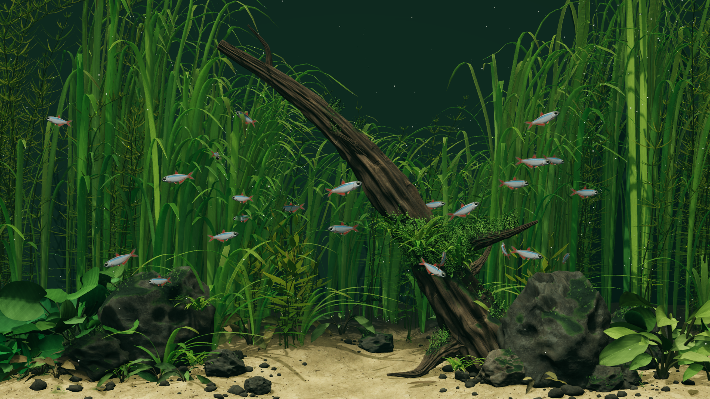
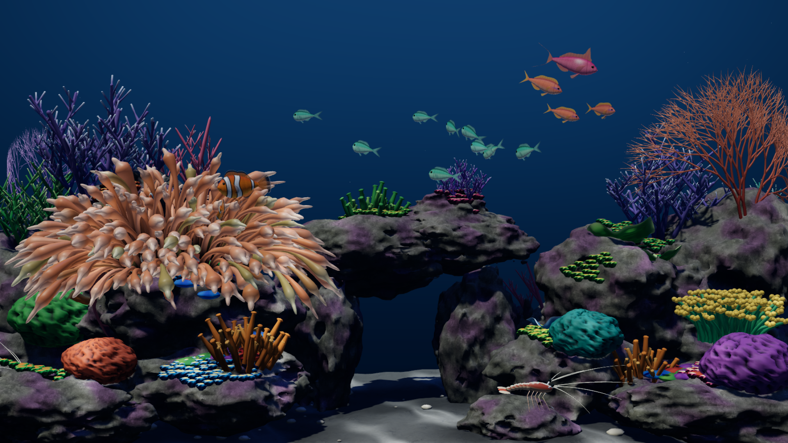

# Desktop Habitats



Have you always wanted an aquarium? Now you can have it, right on your desktop :)

The fish react to your cursor and compete for food, while the plants sway in a slow current. There are two environments: **Riverscape**, a planted freshwater aquarium, and **Reefscape**, a saltwater tank with three clownfish, a host anemone, small reef fish and two cleaner shrimp.



The scene is rendered live with Three.js and WebGL2. Everything runs locally, with no account or internet connection needed after setup. Desktop wallpaper support is **macOS only** for now; both environments also run in a browser. The Mac app starts with Riverscape and remembers the environment you pick from its menu.

## Install on Mac

You need macOS 13 or newer and the Xcode command line tools. To install the tools, open Terminal and run:

```sh
xcode-select --install
```

Wait for that installation to finish. Download and unzip this repository, or clone it, then open Terminal in the project folder and run:

```sh
sh wallpaper/install.sh
```

The script builds the app for your Mac, installs it at `~/Applications/Desktop Habitats.app`, and starts it. It also adds a login item so the aquarium starts when you sign in. Allow about 20 seconds for the first frame to appear.

During installation, macOS may ask whether Terminal can control System Events. This lets the installer set a still image of the aquarium as your desktop picture, underneath the animation. You can decline; the live wallpaper will still work.

You don't need Node.js for the wallpaper. If you already have it, `npm run wallpaper` runs the same installer.

## Use the wallpaper

Click the fish icon in the menu bar:

- **Environment** switches every screen between Riverscape and Reefscape and remembers your choice.
- **Feed** drops ten pellets into each screen's tank, or eight in Reefscape. Uneaten pellets dissolve after 20–40 seconds of running simulation time in Riverscape and 36 seconds in Reefscape, measured from when they touch the water.
- **Pause / Resume** controls the animation. Your choice is remembered across restarts.
- **Quit** closes the app until you open it again or next sign in.

Move your cursor near the fish to see them react. Desktop icons, clicks and dragging work as usual. To feed the fish, use the menu; clicking the desktop does not drop food.

## FAQ

### Does it work on Windows or Linux?

The desktop app supports macOS only. The browser preview needs a browser with WebGL2, but there is no wallpaper installer for Windows or Linux.

### Will it drain my battery?

It uses more power than a still wallpaper because it renders a 3D scene. The amount depends on your Mac, screen resolution and number of displays. There isn't a measured battery-life estimate yet.

Riverscape's optimized build thins the rear rivergrass by about 30%, reduces oversampling and shadow work, and fully stops the render loop when paused or hidden. It keeps 4× multisampling, the HDR lighting, all 24 fish and the foreground planting. On an M5 Pro this halves the GPU time per frame; battery drain has not been measured.

The wallpaper keeps the same frame-rate limits, so rendering improvements are not spent on extra frames. Reefscape caps itself lower still:

| Desktop state | Riverscape | Reefscape |
| --- | --- | --- |
| Clearly visible, plugged in | Up to 60 fps | Up to 30 fps |
| Clearly visible, on battery | Up to 30 fps | Up to 24 fps |
| Mostly covered by windows | Up to 20 fps | Up to 20 fps |
| Almost entirely covered | Stopped | Stopped |
| Low Power Mode, locked screen or sleeping display | Stopped | Stopped |

Pause it from the menu when you want a still aquarium, or quit to close the app completely. These power controls belong to the wallpaper app; the browser previews do not have the same battery-aware limits, though Reefscape offers Eco, Balanced and Detail profiles of its own.

### Does it monitor my keystrokes?

No. The wallpaper does not listen to typing in other apps or record keystrokes. The browser previews handle Space and F only while that page has focus, for pause and fullscreen. Reefscape also uses H to hide its controls.

The wallpaper reads your cursor position so the fish can react. It also checks window positions and sizes to estimate how much of the desktop is visible. It does not capture the contents of those windows, store cursor history, or send this information anywhere.

### Does it need internet access or special permissions?

Once installed, the aquarium works offline. Its code, textures and Three.js library are bundled with the app. There are no analytics or external services.

The app does not request Accessibility, Input Monitoring or Screen Recording access. The optional System Events prompt during installation is for changing the still desktop picture.

### Why have the fish stopped moving?

Open the fish menu to see the current status. The wallpaper stops when it is almost entirely covered, in Low Power Mode, and while the screen is locked or asleep.

If Reduce Motion is enabled in macOS, the aquarium starts paused unless you have already saved a different choice. Choose **Resume** to animate it. Low Power Mode must be turned off before animation can resume.

### Can I use multiple monitors?

Yes. Each display gets its own aquarium, and **Feed** drops food on every display. Each tank renders separately, so more displays can increase power use.

### Do I need to leave Terminal open?

No. The installed app has its own copy of the scene and runs independently. You can close Terminal once installation finishes.

### How do I update it?

Download or pull the latest source, then rerun `sh wallpaper/install.sh` from the project folder. Editing the source alone does not update the installed app. If you installed the earlier Aquatica version, the installer removes its app and login item before starting Desktop Habitats. Its old still image and saved preference are left behind; the new app starts with its own preference.

### How do I remove it and get my old wallpaper back?

From the project folder, run:

```sh
sh wallpaper/uninstall.sh
```

Or use `npm run unwallpaper`. This stops the app, removes its login item and deletes the installed app.

The still image at `~/Pictures/Desktop Habitats.png` stays behind, along with the desktop picture setting. Choose your previous wallpaper in System Settings, then delete the image if you no longer want it. The saved pause and environment preferences are also retained.

## Try it in a browser

With Node.js 20 or newer, run this from the project folder:

```sh
npm start
```

Open [the local preview](http://127.0.0.1:8080). There is no `npm install` step; the library is included. Use `PORT=8081 npm start` if port 8080 is busy, and Ctrl+C to stop the server.

- Click the water to drop food.
- Move the pointer near the fish to interact.
- Press **Space** to pause or resume, and **F** for fullscreen. In Reefscape, **H** hides the controls.
- In Reefscape, **Energy / detail** picks Eco (24 fps), Balanced (30 fps, the default) or Detail (45 fps). These are caps, not promises.

Reduce Motion starts the preview paused. Serve the page over HTTP; opening `index.html` directly will not load its JavaScript modules. Any static server also works, such as `python3 -m http.server 8080 --bind 127.0.0.1` if you have Python installed.

## Development

In Riverscape, one water model drives the plants, drifting particles, fish and underwater lighting. Fish alternate between swimming and coasting, explore the tank, avoid neighbours and compete for pellets. Reefscape runs a fixed-step simulation of its fish and shrimp, with GPU-animated anemone tentacles, merged static coral geometry and a cached hardscape shadow map. Both scenes use raster rendering with custom GLSL shaders, shadows and depth effects.

Each scene lives in its own directory under `scenes/`, with its textures and tests. The root page is a chooser and the Mac app has an Environment menu; there is no plugin system. Reefscape reads the sand and rock maps from Riverscape's assets, so the two directories ship together.

| Files | Purpose |
| --- | --- |
| `scenes/riverscape/index.html`, `wallpaper.html`, `style.css` | Riverscape's preview and wallpaper layouts |
| `scenes/riverscape/src/` | Fish, feeding, plants, water, terrain and rendering |
| `scenes/riverscape/assets/` | Rock, wood and sand textures |
| `scenes/riverscape/tests/` | Riverscape's headless simulation checks |
| `scenes/reefscape/` | Reefscape's preview, wallpaper page, organisms, simulation, baked assets and tests |
| `tools/` | Python scripts that rebuild Reefscape's baked rock mesh and pore maps |
| `wallpaper/` | Mac app and install/uninstall scripts |
| `vendor/` | Bundled Three.js library and license |
| `index.html`, `serve.mjs` | Environment chooser and local server |

Run the checks with Node.js:

```sh
npm run check
npm test
```

These check JavaScript syntax; simulate swimming, spacing, startle responses and feeding; verify render budgets and frame pacing at 60/120 Hz; and confirm that rear-grass thinning leaves the foreground geometry and downstream random sequence unchanged. They also check that paused/hidden scenes have no scheduled render callbacks. Reefscape's tests run three minutes of simulation with deterministic seeding, keep the clownfish near their host, bound the food and check the baked rock mesh and fish geometry. They do not measure Mac battery use.

The default rendering profile is `balanced`. Append `?quality=reference&still=1` to a scene page for the original density/render budgets at simulation time zero, or `?still=1` for the optimized still. Append `diagnostics=1` to enable the local `habitatBenchmark()` function. Nothing is uploaded.

Browser errors appear in the developer console. Wallpaper errors and frame-rate changes go to `/tmp/desktop-habitats.log`. Sending `SIGUSR1` to the Desktop Habitats process saves a snapshot of its first tank to `/tmp/desktop-habitats.png`.

If you change the app's bundle ID, update `com.chaselean.desktop-habitats` in `wallpaper/install.sh`, `wallpaper/uninstall.sh` and `wallpaper/Info.plist` together.

## Credits and license

Desktop Habitats is [MIT licensed](LICENSE). Three.js 0.180.0 is bundled under its [MIT license](vendor/THREE-LICENSE.txt).

The rock, wood and sand textures come from Poly Haven under [CC0](https://polyhaven.com/license): [Rock Boulder Dry](https://polyhaven.com/a/rock_boulder_dry), [Rough Wood](https://polyhaven.com/a/rough_wood) and [Sand 01](https://polyhaven.com/a/sand_01). Reefscape's rock mesh, pore maps, coral texture and organism meshes are procedural, generated by the scripts in `tools/`.
